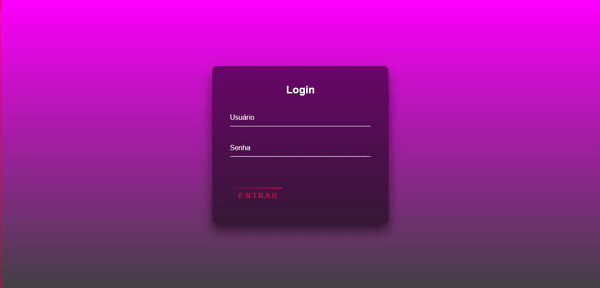
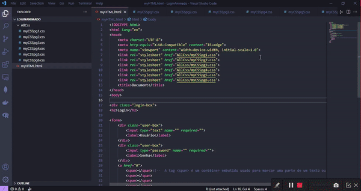

# Projeto Form de Login Animado

Projeto clone da pagina do instagram ***ONEBITCODE***.

## Pagina de Login Animado com HTML5 e CSS

1. Crie uma estrutura básica de projeto front-end (HTML, CSS )
2. Crie uma pasta para separar as tecnologias
3. Selecione os e alterne os elementos

## Exemplo

